# Visual QA sweep, October 2026

Every example, native (headless wgpu, `msaa` on) and web (headless Chromium, WebGPU), at 1x and 2x, looked at
closely: alignment, clipping, text centring, padding, colour contrast, hover / focus states, overlay shadows,
scrollbars. The tool is `tools/qa` (`tools/qa/run.sh [out-dir]`): one binary per example, driven by
`tools/qa/scripts.zig` (the states worth looking at), plus `web.py` / `web.mjs` for the browser half. Crops below are
2x unless noted; "PR" is the fix, "open" is a finding that is deliberately not changed here.

Examples covered: chrome (retro, modern, combobox, popover), counter_greeter (dark, light, hover, help modal),
todo, tree, viewport (zoom/pan, scrolled list), effects, fonts, scene3d, kerf_viewer (section, 3D), gallery (every
page, three looks, menu / dialog / tooltip / toasts / dropdown), notes, tables. scene_layers is not on master yet; the
tool lists it and skips it until its directory exists.

## Fixed

| # | Where | Finding | PR | Crops |
|---|---|---|---|---|
| 1 | framework, `widgets/menu` | The menu panel's 1 px border showed only as two ticks beside the separator: the rows were exactly as wide as the panel and painted over it. | menu-border | 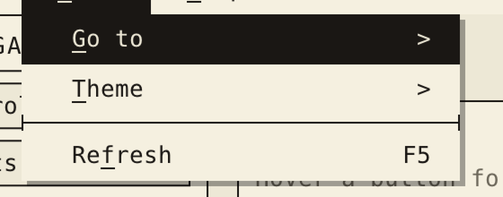 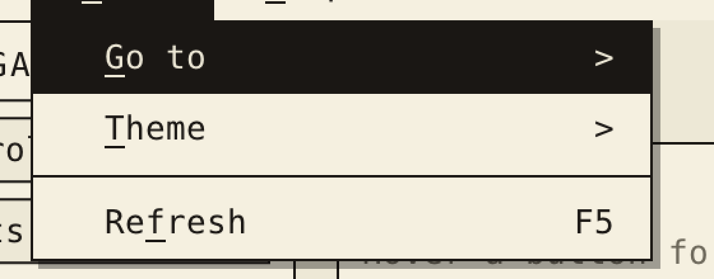 |
| 2 | framework, `theme` | `light_default` / `modern_light` disabled button and input were near-black (they inherited the dark struct defaults). Derived from the palette now. | theme | 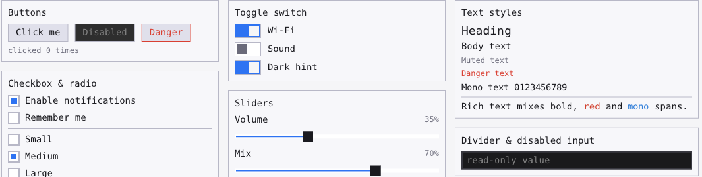 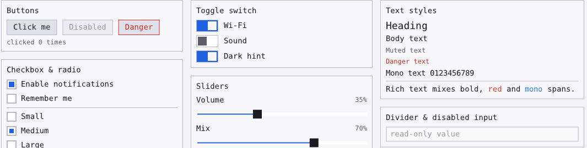 |
| 3 | framework, `theme` | Contrast below WCAG AA (4.5:1) in the presets: light danger 4.1, light accent 4.0, modern_light muted 4.4 / danger 3.6 / accent 4.1, dark muted-on-raised 3.9 (table headers), primary-button label on modern_dark 3.6. Palettes adjusted, primary label picks white or the window colour, `theme.contrast` + a test pin every text pair at >= 4.5. | theme | (numbers, see the PR) |
| 4 | framework, `theme` | Buttons derived from a palette left-aligned their label inside fixed-width boxes (`+`, `x`, `Add`). Now centred. | button-center | 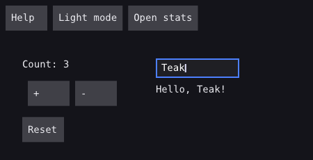  |
| 5 | todo | Item text was garbage / tofu: `for (items) \|item\|` copied the item and its inline label array, so the checkbox label dangled. Capture by pointer (+ a test that fails with the copy); rows pin the delete button right. Same lines as the vreg branch. | todo | 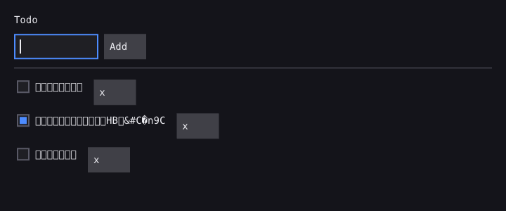 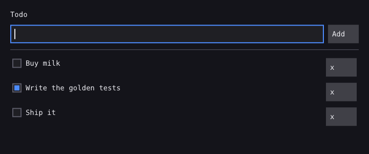 |
| 6 | gallery | Data page: the table header used the heading font, so `QTY` / `LEN MM` did not sit over their columns. | gallery | 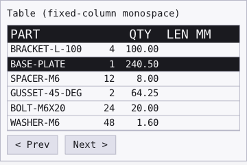 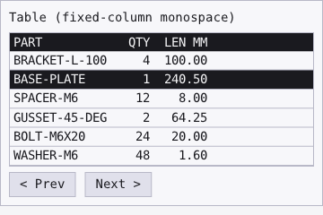 |
| 7 | gallery | Inputs page: the Text area card said it was "not shipped yet". It is a live `TextArea` now. | gallery | 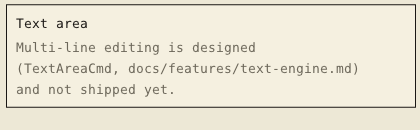 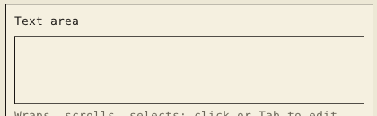 |
| 8 | chrome | Modern look: the REV C tag stayed a retro manila key button (hard-wired style). | chrome | 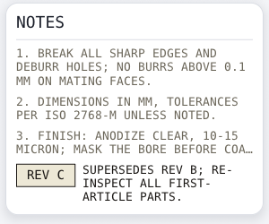 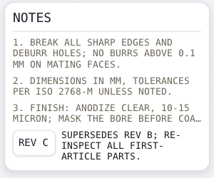 |
| 9 | counter_greeter | The `+` / `-` row sat 8 px right of `Count:` and `Reset` (default group padding). | counter | 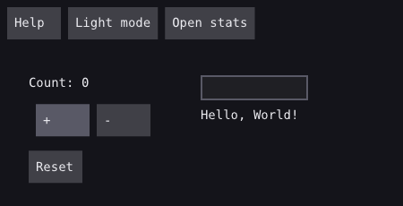 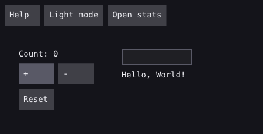 |
| 10 | tables | Status text hung at the top of the tab row; the active tab was light text on bright accent (2.7:1). | tables | 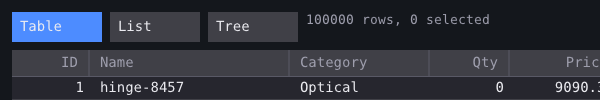 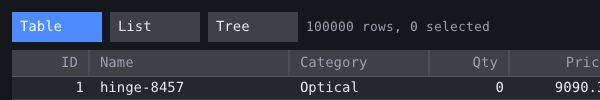 |
| 11 | kerf_viewer | master's example test stopped compiling after the overlay payload became a pointer (#99). | kerf-test | |

## Checked and fine

- Native vs web parity: same layout, Plex (web) vs DejaVu (native) metrics make web rows about 2 px taller; no
  clipping or overflow differences at 1x or 2x. 2x text is crisp on both; hairlines stay 1 logical px.
- Muted text on the retro paper is 5.0:1; kerf_viewer's ink-2 on paper 7:1; gallery light muted 4.9:1.
- Focus rings (blue 2 px on inputs and text areas), hover fills (buttons, table rows), the table / viewport
  scrollbars (thin thumb, dim track), the retro hard shadow and the modern soft shadow on popovers and menus.
- The Quick Keys popover covering the parts table in chrome is by design (it documents the opaque backdrop).

## Open (not changed here)

- `fonts` shows tofu for the fallback line in headless shots: no fallback face is loaded there (font-fallback is #44).
- Toggle thumb (reviewed, kept): the on-state thumb is the window colour on the accent track because that is the
  pair with contrast (5.7:1 in dark_default; the light `fg` thumb would be 2.7:1, under the 3:1 non-text minimum).
  `ToggleStyle.knob_color` overrides it.
- `ButtonStyle.label_align` still defaults to `.start` for hand-built styles; only palette-derived buttons centre.
- tree: every row is two bordered buttons (toggle + name); fine as a demo, noisy as a look.
- Retro popover / menu hard shadow (reviewed, kept): 4 px offset at 1x scales to 8 device px at 2x, as DESIGN.md
  specifies ("2px hard offset shadow"); apps tune `OverlayStyle.shadow_offset`.
- Vreg goldens (#32) of counter_greeter, todo, tables and the light/modern looks move with fixes 2-5, 9, 10;
  regenerate with `zig build vreg -- --update` after those PRs land and LOOK at every changed PNG.

## Note for the HARDLINE audit owner: focus, Model vs TransientState

Not changed; written up as asked. The "duplicated focus" worry turns out to be a one-way derivation plus an
unspecified blur:

- `TransientState.focus_index` is not independent state. `Runtime.updateTransient` recomputes it every frame as
  `focus.indexOfFocusMsg(cmds, App.focusedMsg(model))` (`src/run.zig`, `focusIndex`). The source of truth is the
  Model; what is "duplicated" is the app's own key-routing flag (`m.focus` in kerf_viewer / gallery /
  chrome's `name_focused`) versus the `focusedMsg` it also has to provide. Both come from the same Model field when
  the app is written the documented way, so they cannot disagree.
- They do disagree in practice in two places: (1) a click on something that is not a widget with a focus Msg
  (empty space, a canvas, a scene) produces no Msg, so nothing clears the Model's focus unless the app also handles
  that canvas's events (kerf_viewer needs `blur` in its sheet and scene handlers; chrome and gallery do not blur on a
  blank click, so the caret keeps blinking after clicking empty paper); (2) `focusedMsg` returning a Msg equal to two
  widgets' `focus_msg` resolves to one index (the first match).
- Suggested rule for `docs/HARDLINE.md` section 5 / the hook table: document that focus lives only in the Model, that
  `focusedMsg` is the single bridge, and decide whether a click that hits nothing focusable should be reported (the
  `pointerMsg` proposal in #63 is the natural carrier) so apps can blur without wiring every canvas.
